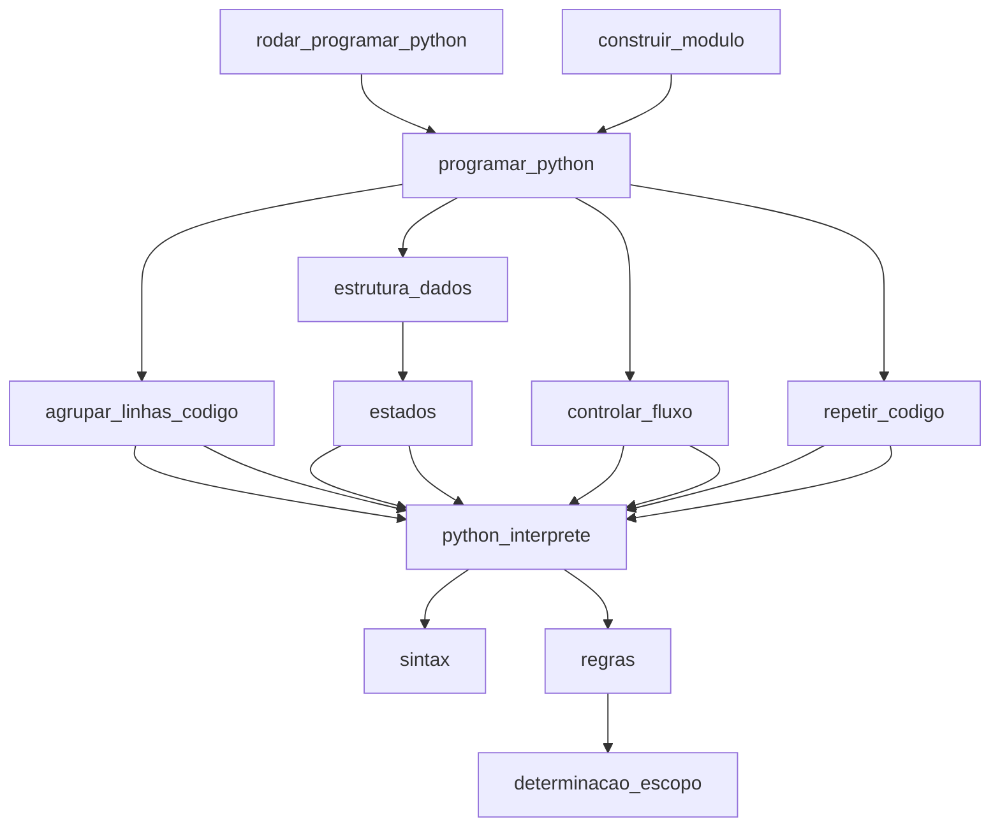
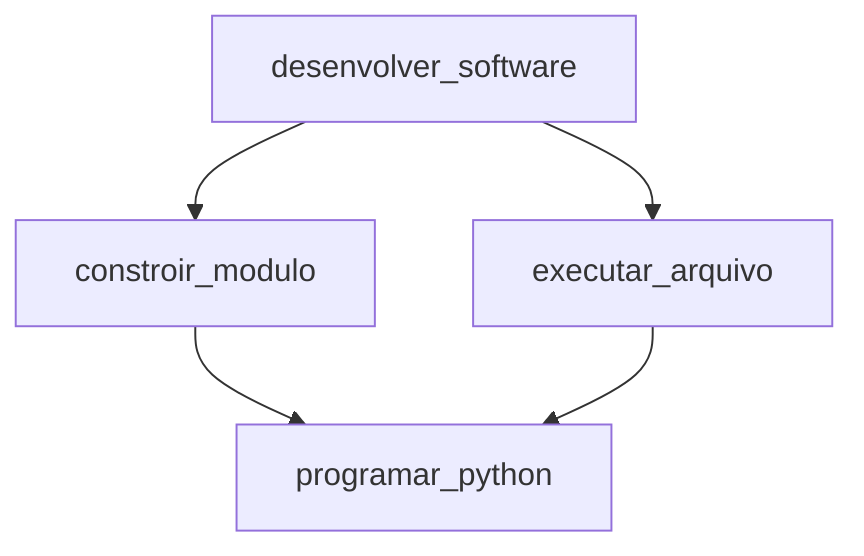

```mermaid
graph TD;


rodar_programar_python --> programar_python
construir_modulo --> programar_python;
programar_python -->agrupar_linhas_codigo --> python_interprete; 
estados --> python_interprete;


programar_python --> estrutura_dados -->estados;
programar_python --> controlar_fluxo -->python_interprete;

programar_python -->repetir_codigo --> python_interprete;

controlar_fluxo --> python_interprete
agrupar_linhas_codigo --> python_interprete;
estados --> python_interprete;
repetir_codigo --> python_interprete;

python_interprete --> sintax;
python_interprete --> regras --> determinacao_escopo;

```

```mermaid
graph TD;
desenvolver_software --> constroir_modulo;
desenvolver_software --> executar_arquivo;

constroir_modulo--> programar_python;
executar_arquivo--> programar_python;

```